  
  

    

  
  
  
  
  

 

  

## Mission brief

I build and run software companies' platforms end to end: the product, the panel behind it, the pipeline that ships it, and the telemetry that proves it works. Most of that work lives in private organisations, which is why the contribution graph below is a lot louder than the public repo list.

**How I work:** threat model first, observability from day one, small verified steps, no skipped hard parts.

| | |
|---|---|
| **Base** | Cape Town, South Africa · SAST (UTC+2) |
| **Studio** | [Millennial Projects](https://millennialprojects.com) |
| **Right now** | .NET 10 + Aspire services, Next.js and Vite frontends, Laravel products, Go and Python tooling |
| **Off hours** | CTFs, writeups, open source, coffee |

## What I'm building

<table width="100%">
  <tr>
    <td width="50%" valign="top">
      <h3>🖨️ <a href="https://github.com/SimmelPrints">SimmelPrints</a></h3>
      
Custom-print e-commerce: catalogue, bundles, order pipeline and a marketing site. 280+ pull requests in.

      
<code>Next.js</code> <code>TypeScript</code> <code>Python</code>

    </td>
    <td width="50%" valign="top">
      <h3>💸 <a href="https://github.com/Paybru">Paybru</a></h3>
      
Community and creator payments platform: web, mobile, design system, infrastructure and a help centre. 1,500+ pull requests merged.

      
<code>C# / .NET</code> <code>TypeScript</code> <code>Docker</code> <code>OpenTelemetry</code>

    </td>
  </tr>
  <tr>
    <td width="50%" valign="top">
      <h3>🔐 <a href="https://github.com/P-ssword123">P-ssword123</a></h3>
      
A password manager shipped as a product family: web, desktop, mobile and a browser extension with single sign-on. 270+ pull requests on the core alone.

      
<code>Laravel</code> <code>TypeScript</code> <code>Tauri</code> <code>React Native</code>

    </td>
    <td width="50%" valign="top">
      <h3>📡 <a href="https://github.com/Streamposer">Streamposer</a></h3>
      
Streaming operations platform: ingestion, sessions, trends, billing and a web front. 770+ pull requests on the monorepo.

      
<code>C# / .NET</code> <code>Python</code> <code>TypeScript</code>

    </td>
  </tr>
  <tr>
    <td width="50%" valign="top">
      <h3>🛠️ <a href="https://github.com/mpcore-stack">MPCore stack</a></h3>
      
The Millennial Projects platform: hosting panel, security panel, account and SSO, WordPress panel, support desk and CorePress.

      
<code>.NET Aspire</code> <code>TypeScript</code> <code>Ruby</code> <code>Cloudflare</code>

    </td>
    <td width="50%" valign="top">
      <h3>🕵️ <a href="https://github.com/CoreWebsites-Projects">Visual Int</a></h3>
      
OSINT and breach-intelligence suite: web platform, desktop app and browser extension, with a compromised-data index behind it.

      
<code>PHP</code> <code>TypeScript</code> <code>Electron</code>

    </td>
  </tr>
</table>

**Also in flight:** [BizRep](https://github.com/BizRepZA), a business-reputation platform with AI credit controls · [RegIntel](https://github.com/Reg-Intel), multi-tenant regulatory intelligence in Go · a takeoff-automation platform that reads civil engineering plans and extracts structures with vision models and a truth-gated review workbench.

**For clients:** a retail control tower and asset CDB, an LLM-backed HR assistant, a Grafana / OpenTelemetry observability stack, an endpoint verification daemon, and a CrowdStrike + Sysmon deployment package.

## Open tools

| Tool | What it does | Stack |
|---|---|---|
| [clear-rows](https://github.com/edwynmoss/clear-rows) | Local-first desktop app that opens and searches giant CSV, TSV and text exports without freezing. Built for incident review and asset dumps. | Tauri 2 · Rust · TypeScript |
| [origin_finder](https://github.com/edwynmoss/origin_finder) | Finds origin servers hiding behind Cloudflare, CloudFront, Akamai and Fastly. Mass scanning, CIDR ranges, Burp integration. | Python |

## Stack atlas

  
<strong>Languages</strong>

  
  
  
  
  
  
  

  
<strong>Frontend</strong>

  
  
  
  
  

  
<strong>Backend</strong>

  
  
  
  
  
  
  

  
<strong>Security and operations</strong>

  
  
  
  
  
  
  
  

## Signal

  

  
  

## Activity

  <picture>
    <source media="(prefers-color-scheme: dark)" srcset="https://raw.githubusercontent.com/edwynmoss/edwynmoss/output/github-contribution-grid-snake-dark.svg">
    <source media="(prefers-color-scheme: light)" srcset="https://raw.githubusercontent.com/edwynmoss/edwynmoss/output/github-contribution-grid-snake.svg">
    
  </picture>

 

  

